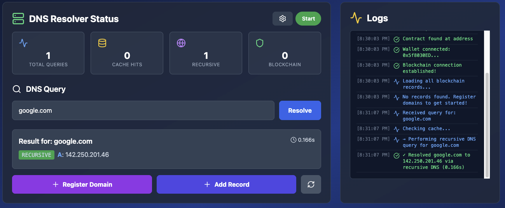
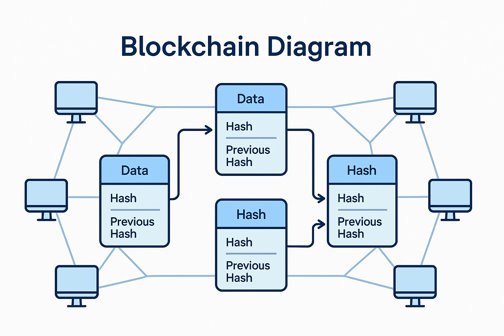
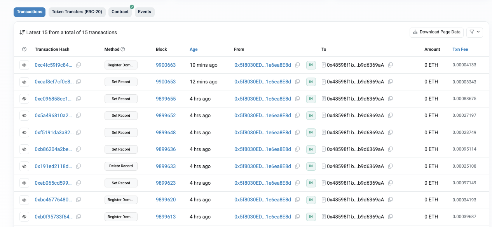

# Blockchain-based DNS

A decentralized Domain Name System (DNS) built on Ethereum smart contracts, combining the security of blockchain with recursive DNS resolution capabilities. This project demonstrates how blockchain can eliminate centralized DNS vulnerabilities while maintaining interoperability with the existing DNS ecosystem.

**Author:** Omar Khalifa



---

⚠️ **DEVELOPMENT WARNING**

> **This project is currently under active development.** Security issues are still being addressed and investigated. 
> 
> **DO NOT use your actual cryptocurrency wallet or real private keys for testing.** Only use testnet funds (Sepolia ETH) with test wallets created specifically for development. Any real crypto is at risk of loss due to bugs or vulnerabilities.

<br>

## Problem Statement

The traditional DNS infrastructure is **centralized**, creating vulnerabilities:
- ❌ Single points of failure at root servers
- ❌ Susceptibility to cache poisoning attacks
- ❌ Potential for censorship and unauthorized control
- ❌ Lack of transparency in domain management

This project proposes a **decentralized DNS architecture** using Ethereum smart contracts for domain ownership and record management.

---

## Features

- **Decentralized Domain Registration** - Register domains on-chain with transparent ownership
- **Multiple DNS Record Types** - Support for A, AAAA, CNAME, TXT, MX, and other record types
- **Smart Contract Control** - Domain records managed through immutable smart contracts
- **Recursive Resolver** - Hybrid resolver capable of querying both blockchain and traditional DNS
- **DNS Cache Support** - In-memory caching for improved query performance
- **Real-time Monitoring** - Dashboard to track queries, cache hits, and blockchain interactions
- **ETH Integration** - Built on Ethereum with Ethers.js for seamless Web3 interaction

---

## Project Structure

```
.
├── BlockchainDNS.sol          # Core smart contract
├── config.js                  # Configuration file
├── doc.md                     # Detailed research documentation
├── Readme.md                  # This file
├── images/                    # Screenshots and Images for the app
│   ├── 1.png
│   ├── 2.png
│   ├── ..
│
└── dns-frontend/              # React frontend dashboard
    ├── src/
    │   ├── App.jsx            # Main application component
    │   ├── BlockchainDNS.jsx  # Blockchain DNS interface
    │   ├── main.jsx           # React entry point
    │   ├── App.css            # Styles
    │   └── index.css          # Global styles
    ├── package.json
    ├── vite.config.js
    ├── tailwind.config.js
    └── index.html
```

---

## Getting Started

### Installation

1. **Clone and navigate to the project:**
   ```bash
   cd /Users/username/project_folder
   ```

2. **Install dependencies:**
   ```bash
   npm install
   cd dns-frontend
   npm install
   cd ..
   ```

3. **Set up environment variables** in `config.js`:
   ```javascript
   const config = {
     rpcUrl: 'https://sepolia.infura.io/v3/YOUR_INFURA_KEY',
     contractAddress: '0xYOUR_DEPLOYED_CONTRACT_ADDRESS',
     privateKey: 'YOUR_PRIVATE_KEY' // Only for testing
   };
   ```

---

## Smart Contract Overview

### BlockchainDNS.sol

The smart contract manages:
- **Domain Registration** - Register new domains
- **DNS Record Management** - Set, update, and retrieve records
- **Ownership Control** - Domain-specific access control
- **Multiple Record Types** - A, AAAA, CNAME, TXT, MX, etc.


#### Key Functions:

```solidity
// Register a new domain
function registerDomain(string memory domain) external

// Set a DNS record
function setRecord(
    string memory domain,
    string memory recordType,
    string memory value,
    uint256 ttl
) external

// Retrieve a DNS record
function getRecord(string memory domain, string memory recordType) 
    public view returns (DNSRecord)

// Transfer domain ownership
function transferDomain(string memory domain, address newOwner) external

// Release a domain
function releaseDomain(string memory domain) external
```

---

## Usage

### Deploy Smart Contract

1. **Open Remix IDE**: https://remix.ethereum.org
2. **Upload** `BlockchainDNS.sol`
3. **Select Solidity Compiler** (0.8.0+)
4. **Compile** and **Deploy** to Sepolia testnet
5. **Copy contract address** to `config.js`

### Start the Frontend Dashboard

```bash
cd dns-frontend
npm run dev
```

Open http://localhost:5173 to access the dashboard for:
- Registering domains
- Managing DNS records
- Monitoring resolver statistics
- Testing queries

#### Screenshot from etherscan transactions

Transactions are stored on blockchain and verified by [etherscan](https://sepolia.etherscan.io/)

---

## Comparison with Existing Solutions

| Solution | Centralized | Smart Contracts | Full Resolver | DNS Compatible |
|----------|:----------:|:---------------:|:------------:|:---------------:|
| **Traditional DNS** | ✅ | ❌ | ✅ | ✅ |
| **ENS** | ❌ | ✅ | ❌ | ❌ |
| **Handshake** | ❌ | ❌ | ❌ | ❌ |
| **Namecoin** | ❌ | ❌ | ❌ | ❌ |
| **Blockchain DNS** | ❌ | ✅ | ✅ | ✅ |

---

## Documentation

For detailed research, architecture, and analysis, see [doc.md](./doc.md):
- Background on DNS and blockchain
- Research problem and objectives
- Analysis of existing solutions
- Performance evaluation
- Future work

---

## 🔐 Security Considerations

- ✅ **Ownership Control** - Only domain owner can modify records
- ✅ **Immutable Records** - Records stored on immutable blockchain
- ✅ **Transparent History** - All transactions visible on-chain
- ⚠️ **Testnet Only** - Currently deployed on Sepolia for testing
- ⚠️ **No Fee System** - Consider adding registration fees in production

---

## Tech Stack

- **Smart Contract**: Solidity ^0.8.0
- **Blockchain**: Ethereum (Sepolia Testnet)
- **Frontend**: React 19 + Vite
- **Styling**: Tailwind CSS
- **Web3**: Ethers.js
- **Icons**: Lucide React
- **Testing**: Custom test suite
- **IDE**: Remix

---

## Deployment

### To Mainnet (Production)

1. Add production safeguards (fees, rate limiting, etc.)
2. Conduct security audit
3. Deploy to Ethereum mainnet
4. Update RPC URL in config.js
5. Configure custom domain resolver integration

### Environment Variables

```javascript
// config.js
export const config = {
  rpcUrl: process.env.RPC_URL,
  contractAddress: process.env.CONTRACT_ADDRESS,
  networkName: process.env.NETWORK || 'sepolia'
};
```

---

## Roadmap

- [ ] Production-grade resolver with caching strategies
- [ ] Fee system for domain registration
- [ ] Domain expiration and renewal mechanism
- [ ] DNSSEC integration
- [ ] Multiple blockchain support (Polygon, Arbitrum)
- [ ] DNS-over-HTTPS (DoH) endpoint
- [ ] Batch record operations
- [ ] Governance DAO for TLD management

---

## Contributing

Contributions are welcome! Please:

1. Fork the repository
2. Create a feature branch (`git checkout -b feature/feature-name`)
3. Commit changes (`git commit -m 'Add amazing feature'`)
4. Push to branch (`git push origin feature/feature-name`)
5. Open a Pull Request

---

## License

This project is licensed under the **MIT License** - see the [LICENSE](./LICENSE) file for details.

---

## Support

For issues, questions, or suggestions:
- Open an issue on GitHub
- Check [doc.md](./doc.md) for detailed documentation
- Review the smart contract comments for function details

---

## Acknowledgments

- Ethereum Foundation
- ENS (Ethereum Name Service) - Inspiration for smart contract design
- Handshake - Alternative approach to decentralized naming
- Remix IDE - Smart contract development environment

